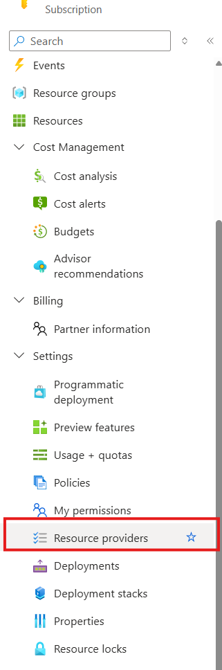
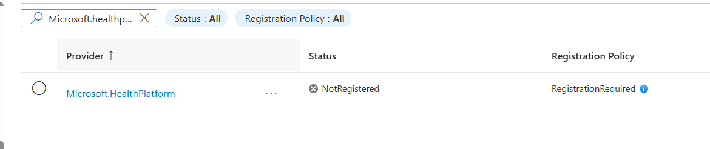
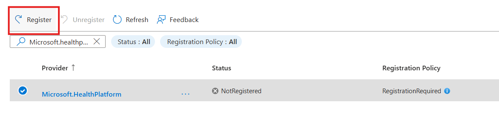

# Table of Contents
- [Quick Start Guide for Dragon Extension Developer](#quick-start-guide-for-dragon-extension-developer)
- [Running Locally](#-running-locally)
  - Provides prerequisites and information on how to run the application locally. 
- [Using DevTunnels](#using-devtunnels)
  - How to create a secure way to expose your local web service to the internet without actually deploying.
- [Packaging your extension](#packaging-your-extension)
  - How to package your extension using the dragon extension tool to to the DAC (Dragon Admin Center) site.
- [Create an Application in Azure portal that represents your application](#create-an-application-in-azure-portal-that-represents-your-application)
  - How to register your extension in the Azure portal so it can be used with Dragon Copilot.
- [Installing your Extension](#installing-your-extension)
  - How to install your extension you created onto the DAC site. 
- [Testing your Extension](#testing-your-extension)
  - How to test your extension in Dragon Copilot.

# Quick Start Guide for a Dragon Extension Developer
This document is a quick‑start guide for building, testing, packaging, and deploying a custom Dragon Copilot extension. Its purpose is to walk an extension developer through the full development lifecycle—from setting up the environment to validating the extension inside the Dragon Copilot application. 

Prior to running through this document, you may want to read through the Microsoft Learn [documentation](https://learn.microsoft.com/en-us/industry/healthcare/dragon-copilot/extensions/workflow-app-overview) outlining how your extension will interface with the overall Dragon Copilot solution.

## 🚀 Running Locally

### Development Prerequisites
* DotNet 9
* Node 22.20.0
* npm 10.9.3

### Local Development Environment
1. Clone the repository
1. Open a terminal and navigate to `samples/DragonCopilot/Workflow/SampleExtension.Web`
1. Issue a `dotnet run`

The application will start and be available at http://localhost:5181

Some additional development concepts are located in the following Microsoft Learn [documentation](https://learn.microsoft.com/en-us/industry/healthcare/dragon-copilot/extensions/workflow-app-concepts).
### Call the endpoint
You can make use of the [SampleExtension.Web.http](./samples/DragonCopilot/Workflow/SampleExtension.Web/SampleExtension.Web.http) file in the sample project to make a call. It contains a sample invocation for an extension listening for `Note` content.

You should see an output similar to the following:
```
HTTP/1.1 200 OK
Connection: close
Content-Type: application/json; charset=utf-8
Date: Mon, 06 Oct 2025 13:20:44 GMT
Server: Kestrel
Transfer-Encoding: chunked

{
    "success": true,
    "message": "Payload processed successfully",
    "payload": {
    "sample-entities": {
        "schema_version": "0.1",
        "document": {
        "title": "Outpatient Note",
        "type": {
            "text": "string"
        }
        },
        "resources": []
    },
    "adaptive-card": {
        // abbreviated
    }
}
```
Details about an adaptive card structure and what fields are valid is located in the [Adaptive Card Specification](https://learn.microsoft.com/en-us/industry/healthcare/dragon-copilot/extensions/adaptive-card-spec).

### Making Code Changes
The majority of the code changes for your extension should fall underneath the [Process API](./samples/DragonCopilot/Workflow/SampleExtension.Web/Controllers/ProcessController.cs#L58-L95) method.  The Process API will be called by Dragon Copilot to execute your extension.

##  Using DevTunnels
DevTunnels provide a secure way to expose your local web service to the internet without actually deploying.
1. [Install dev tunnel](https://learn.microsoft.com/en-us/azure/developer/dev-tunnels/get-started?tabs=windows#install).
2. In a terminal, issue a `devtunnel login` command and select your appropriate account.
3. Issue a `devtunnel create name-of-tunnel -a` command
4. Issue a `devtunnel port create name-of-tunnel -p 5181` command
5. Issue a `devtunnel host name-of-tunnel` command
6. Copy the URL that is output in the terminal. Make sure to copy the dev tunnel "connect via browser url" as shown in example below.

    

##  Packaging your extension
We are now going to package our extension using the dragon-extension CLI tool.

1. Open a new terminal window
2. Traverse to tools/dragon-extension-cli
3. Issue a `npm run build` command
4. Issue a `npm link` command
5. Issue a `dragon-extension init` command
  You will be asked for information on your extension.  
    - Ensure the tenantId specified is for where you will upload your extension to.
    - Ensure the api endpoint points to the process method using the devtunnel address you generated earlier.
6. Issue a `dragon-extension package` command
You now have a valid zip file that represents your extension!

##  Add the Service Principal to your tenant
We need to register the "Microsoft.HealthPlatform" resource provider in an Azure subscription that belongs to your tenant. This will inject a Service Principal (a.k.a. "Enterprise Application") for the Dragon Copilot Extension Runtime application registration into the Extension vendor's tenant. This step will only need to be done once for your tenant.

1. Log into http://entra.microsoft.com
2. Go to Subscriptions and select your subscription.
      
   
5. Select Resource Providers on the left hand menu.

   
   
6. Search for "Microsoft.HealthPlatform".

   
   
7. Select the entry and click the Register button.

   

##  Create an Application in Azure portal that represents your application.
1. Log into http://entra.microsoft.com
2. Go to App registrations on the left menu

      
3. Create a new registration

      
4. Name your application what you want and ensure it is a "Single tenant Application"

      
5. Once complete go to the "Expose an API" on the left side.

      
6. Add an Application ID URI.  The format should be: `api://{entra-tenantid}/{devtunnelpath}`
   - (i.e. api://1abcdefg3-n2g4-56dd-jj10-i34lmn5p7rst/k2dkm8r-7156.use.devtunnels.ms)

5. Click the "Save" button
6. In the application details navigation, select "Token Configuration"

    
7. Select "Add Optional Claim" in the details section
    
    
8. For token type select "Access" and in the list of claims select "idtyp"

    
9. Click the "Add" button
10. In the application details navigation, select "Manifest"

    
11. Find the property "requestedAccessTokenVersion" and change the value from `null` to `2`

    
12. Click the "Save" button

## Installing your Extension

1. Open the browser and go to `https://admin.healthplatform.microsoft.com/extensions`
2. Click the dropdown at the top to select the environment on the card you were given.

    
3. In the page navigation click "Upload custom"

    
4. Select the previously created zip file in the folder `tools/dragon`

5. Agree to the terms

    
6. Click the "Upload custom" button

## Testing your Extension
1. Open the browser and go to `https://www.copilot.us.dragon.com`
2. Click "Sign In"
3. Allow the use of the microphone in the popup in the top left.
4. Go through the initial setup
    1. Select any Primary specialty
    2. Click "Next"
    3. Select any role
    4. Click "Next"
    5. Click "Complete setup"
5. Switch environment using following steps:
    1. Click "Settings"
    
    2. Click "General"
    3. Select your assigned environment from the dropdown
    
    4. Click "Reload app" in Change Environment popup
    
    5. Go through step 4 i.e. initial setup of selecting specialties.

6. Ensure "Auto-style" is enabled
    1. Click the gear icon in the top right
    
       
    3. Click "Note style & format" in the menu
    
    	
    5. Click "Style" in the menu
    
    	
    7. Toggle "Auto-style" to enabled
    
    	 
    9. This setting is auto-saved and only needs to happen once
6. Ensure other extensions disabled
    1. Click the gear icon in the top right
    
       
    2. Click "Extensions" in the menu
    3. Select extensions besides your own
    4. Toggle the extension off
    5. This setting is auto-saved and only needs to happen once
7. Click "Create patient session" in the bottom left
    
8. Create an ambient recording by clicking the button to the right of the prompt box in the bottom.
    
   
   You can refer to [audio recordings](./samples/audio-recordings) contained in the repository for examples of typical recordings.
10. Sample script:

  > Mr. John Doe is a 55-year-old male here for follow-up on hypertension. He's taking lisinopril 20 milligrams daily with good adherence. Blood pressure today is 128 over 78, heart  rate 72. He reports no chest pain, shortness of breath, or headaches. He does note occasional mild dizziness when standing quickly, otherwise feels well. Exam is unremarkable, lungs are clear, heart regular, no edema.
  > 
  > Assessment: Hypertension, well controlled. Mild orthostatic dizziness likely related to medication but not impacting daily function.
  >
  > Plan: Continue current lisinopril dose. Encourage hydration and slower positional changes. Reinforced diet and exercise recommendations. Ordered labs for next visit. Follow up in six months or sooner if symptoms worsen.

7. Click the same button to stop recording.

8. After recording is complete you should see a number of things happen:
    * Recording uploaded
    * Note generated
    * Auto-style executed
    * Extension executed and displayed in the Note section.
 	

9. Click the "Note" tab and scroll to the bottom to see your results
	
