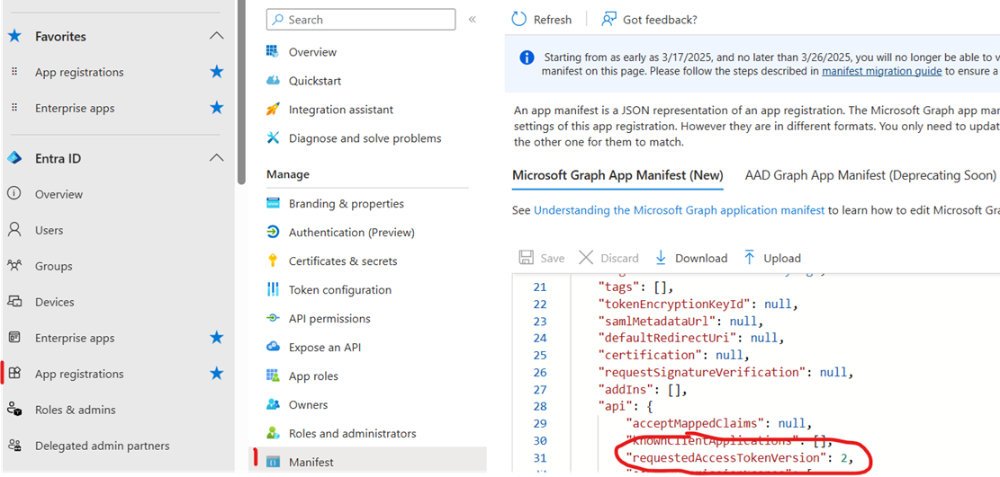
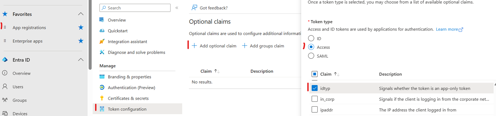

# Authentication and Authorization Design Documentation

## Overview

The Dragon Copilot Extension Runtime supports a multi-layered security approach combining **Microsoft Entra ID authentication** for service-to-service request security with **custom license key validation** for customer authorization. This design provides both enterprise-grade identity verification and flexible business logic enforcement.

This document describes the detailed Entra Id configuration and token validation required to protect against the identified threats.

Additionally, you will find the threat model applied to the service-to-service requests send from the Dragon Copilot Extension Runtime to the Extension and describes the .

See [Authentication.md](Authentication.md) for implementation details in the Sample Extension.

> **Related tooling**: The `dragon-copilot` CLI generates manifest version 3 files that capture the same tenant identifiers discussed here. Ensure the values provided to the CLI match the configuration steps below so request validation succeeds.

## Service-to-Service Authentication Overview

The Dragon Copilot Extension Runtime receives extension configuration including the extension's endpoint and authentication information.
Using this configuration, it sends requests potentially containing sensitive data (such as PHI) to the extension's endpoint, accompanied by an OAuth 2 access token.

```
┌───────────────────────────┐    ┌───────────────────┐    ┌──────────────┐    ┌───────────────────────┐    ┌────────────────┐
│ Extension Configuration:  │--->│ Dragon Copilot    │--->│ Request w/   │--->│ Extension Endpoint w/ │--->│ Extension      │
│ Extension URL + Auth Info │    │ Extension Runtime │    │ OAuth 2 JWT  │    │ JWT Claims validation │    │ Business Logic │
└───────────────────────────┘    └───────────────────┘    └──────────────┘    └───────────────────────┘    └────────────────┘
                              ^                                            ^
                              |                                            |
                        Trust Boundary                               Trust Boundary
```

## Entra Id Configuration

The Dragon Copilot Extension Runtime is represented in Entra Id by an application registration with Application Id (a.k.a. "Client Id") `d9350f5d-71c2-46b9-b41d-3c5d51ffe6e8`.

## Add the Service Principal to your tenant

This step is required only once per tenant.

* **Option 1 (Preferred)**: Register the "Microsoft.HealthPlatform" resource provider in an Azure subscription that belongs to this tenant. This will inject a Service Principal (a.k.a. "Enterprise Application") for the Dragon Copilot Extension Runtime application registration into the Extension vendor's tenant.
* Option 2: The Service Principal can be created by a tenant administrator using the `New-MgServicePrincipal -AppId d9350f5d-71c2-46b9-b41d-3c5d51ffe6e8` PowerShell command.

## Configure your Extension's Entra Id Application Registration

Create a [single-tenant application registration](https://learn.microsoft.com/en-us/entra/identity-platform/quickstart-register-app#register-an-application).

Configure the following settings:
- Configure the Application ID URI with a format of `["api://{Tenant id}/{extension endpoint hostname}"]`.
  
  > Note that multiple values can be configured (e.g. for different deployments) by editing the `identifierUris` array in the application registration's manifest.
- Ensure that Entra Id v2.0 access tokens will be generated by setting "requestedAccessTokenVersion: 2" in the manifest. (This will ensure that the `aud` claim contains the 3P client id.)
  
- Ensure that the optional `idtyp` claim is added to the token.
  

## Threat Analysis

Note that this only covers the service-to-service communication from the Dragon Copilot Extension Runtime to the Extension's endpoint.

See Section [Entra Id Configuration](#entra-id-configuration) for details on the values to be configured to mitigate the listed threats.

### Dragon Copilot Extension Runtime Responsibilities

- _Goal:_ Each request is sent to the configured Extension endpoint and its confidentiality and integrity are ensured.
  _Realization:_ HTTPS using TLS 1.2+ with server certificates validated by the sender.
- _Goal:_ The Extension for which the token is created is controlled by the owner of the configured Extension endpoint.
  _Realization:_ Verify that the Extension hostname is included in the Extension's Application ID URI.

### Extension Responsibilities

- _Goal:_ Only accept tokens signed by the Entra Id tenant controlled by the Extension vendor.
  _Realization:_ Validate the `iss` claim in the JWT.
  The `iss` claim must be of the form `https://login.microsoftonline.com/{Extension vendor's tenant id}/`
- _Goal:_ Only requests from the Dragon Copilot Extension Runtime (and possibly other trusted senders) are accepted.
  _Realization:_ Validate the `idtyp` and `azp` claims in the JWT.
  The `idtyp` claim must contain the string "app" and the `azp` claim must contain the Dragon Copilot Extension Runtime's Application Id (a.k.a. "Client Id"): d9350f5d-71c2-46b9-b41d-3c5d51ffe6e8.
- _Goal:_ Only requests that were created for the Extension are accepted.
  _Realization:_ Validate the `aud` claim in the JWT.
  The `aud` claim must contain the Extension vendor's Application Id (a.k.a. "Client Id").

## Related Documentation

- [Entra ID Access Token Claims Reference](https://learn.microsoft.com/en-us/entra/identity-platform/access-token-claims-reference)
- [Entra ID Optional Claims Reference](https://learn.microsoft.com/en-us/entra/identity-platform/optional-claims-reference)
- [Secure applications and APIs by validating claims](https://learn.microsoft.com/en-us/entra/identity-platform/claims-validation)

